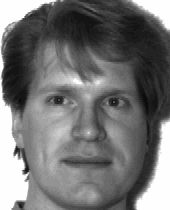

 

# ISYE 6740 Final Project
This respository contains the code and writeup for my course final project. In the project, I explore a [common problem](https://www.businessinsider.com/iphone-face-id-not-working-with-mask-try-workaround-trick-2020-4) many iPhone users experienced during the height of the COVID-19 pandemic - that Face ID failed to work while they were wearing a face mask. I extend this exploration to see if similar results hold for iPhone users wearing sunglasses, and finally explore whether there is a certain amount of facial "obstruction" that induces a sharp dropoff facial recognition performance. 

## Getting started
To run this code yourself, create a Python virtual env using the `requirements.txt` and run `final_nb.ipynb`.

## Dataset
I used a subset of the [Yale Faces](https://www.kaggle.com/datasets/olgabelitskaya/yale-face-database) dataset for this project.

## Workflows
### Adding masks

This is a demonstration of how facemasks were applied to test faces and partial facemasks were applied to training faces along with an unmasked eigenface for subject 1.

### Adding sunglasses

This is a demonstration of how sunglasses were applied to training and test faces along with a "sunglasses" eigenface for subject 1.

### Obstructing

This is a demonstration of how general facial obstruction was applied to subject 1's test face, starting from 5% and ending at 95% facial area obstruction.

## Contact
For more information, please reach me at [diamax98@gmail.com](diamax98@gmail.com).
